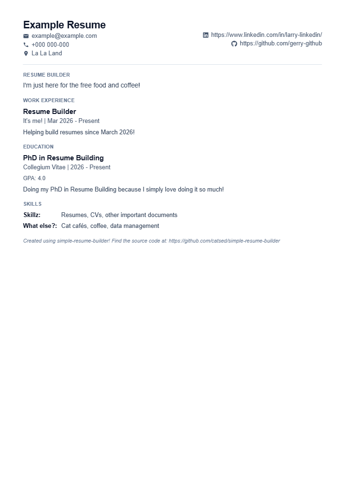

# Resume Builder

A resume builder web app built with React, TypeScript, Vite, and Tailwind CSS.

The app provides a tab-based editor for personal info, work experience, education, and skills, along with a live resume preview and export tooling.

Building a clean [JSON Resume](https://github.com/jsonresume) by hand can get old fast. This tool exists to make that workflow way less painful: fill forms, preview instantly, export when ready.

## Tech Stack

- React 19
- TypeScript 5
- Vite 7
- Tailwind CSS 4
- Jest + Testing Library
- ESLint 9

## Features

- Multi-tab resume editor:
  - Personal Info
  - Experience
  - Education
  - Skills
- Reorderable resume sections/items in editor lists
- Live resume preview panel
- PDF export from preview
- JSON Resume export
- JSON Resume import
- Persistent editor state in localStorage
- Responsive split layout for desktop and mobile

## Project Structure

```text
resume-builder/
	public/
	src/
		components/
			common/            # Shared input/button primitives
			editor/            # Reusable editor card/section wrappers
			tabs/              # Tab content for resume sections
		hooks/
			resumeEditor/      # State hooks for each resume section + orchestration
		lib/
			resumeStorage.ts   # localStorage persistence
		types/
			resume.ts          # Core app and JSON Resume types
		utils/
			json/              # JSON Resume conversion and file IO
	test/
		components/
		hooks/
		lib/
		utils/
```

## Prerequisites

- Node.js 20 or newer
- npm 10 or newer

## Getting Started

Install dependencies:

```bash
npm install
```

Start development server:

```bash
npm run dev
```

## Available Scripts

- `npm run dev`
  - Starts Vite in development mode with hot reload.
- `npm run build`
  - Runs TypeScript project build (`tsc -b`) and creates optimized production assets in `dist/`.
- `npm run preview`
  - Serves the built `dist/` output locally so you can verify production behavior.
- `npm run lint`
  - Runs ESLint across the project.
- `npm run test`
  - Runs Jest tests once.
- `npm run test:watch`
  - Runs Jest in watch mode.

## How to Run the Built Version

Build first:

```bash
npm run build
```

Then preview the production output:

```bash
npm run preview
```

## Testing

Run all tests:

```bash
npm run test
```

Run tests in watch mode:

```bash
npm run test:watch
```

## Linting

```bash
npm run lint
```

## Data Model and Persistence

- Internal editor state is maintained via section-specific hooks under `src/hooks/resumeEditor/`.
- State is converted to/from JSON Resume format.
- Data is persisted in browser localStorage under key:
  - `resume-builder:json-resume`

## JSON Resume Import/Export

- Export JSON generates a JSON Resume document from the current editor state.
- Import JSON accepts a JSON Resume file and maps it into editor state.
- Invalid files show a user-facing alert.

### Example JSON -> Preview

This JSON (compliant with JSON Resume schema) maps to the preview shown below:

```json
{
  "basics": {
    "name": "Example Resume",
    "label": "Resume Builder",
    "image": "",
    "email": "example@example.com",
    "phone": "+000 000-000",
    "url": "",
    "summary": "I'm just here for the free food and coffee!",
    "location": {
      "address": "",
      "postalCode": "",
      "city": "La La Land",
      "countryCode": "",
      "region": ""
    },
    "profiles": [
      {
        "network": "GitHub",
        "username": "",
        "url": "https://github.com/gerry-github"
      },
      {
        "network": "LinkedIn",
        "username": "",
        "url": "https://www.linkedin.com/in/larry-linkedin/"
      }
    ]
  },
  "work": [
    {
      "name": "It's me!",
      "position": "Resume Builder",
      "url": "",
      "startDate": "Mar 2026",
      "endDate": "Present",
      "summary": "Helping build resumes since March 2026!",
      "highlights": []
    }
  ],
  "education": [
    {
      "institution": "Collegium Vitae",
      "url": "",
      "area": "Resume Building",
      "studyType": "PhD",
      "startDate": "2026",
      "endDate": "Present",
      "score": "4.0",
      "courses": [
        "Doing my PhD in Resume Building because I simply love doing it so much!"
      ]
    }
  ],
  "skills": [
    {
      "name": "Skillz",
      "level": "",
      "keywords": ["Resumes", "CVs", "other important documents"]
    },
    {
      "name": "What else?",
      "level": "",
      "keywords": ["Cat caf\u00e9s", "coffee", "data management"]
    }
  ]
}
```



### Current Scope

This project is currently calibrated very closely to one CV format (namely to accommodate for my own CV). It is excellent for that shape, but intentionally not a full JSON Resume editor.

Right now it does not support:

- Multiple pages
- All JSON Resume sections (for example: volunteer, awards, certificates, publications, languages, interests, references, projects)
- Broad schema customization beyond the implemented tabs
- Custom resume templates (though the template is relatively optimised for ATS systems)

## Production Deployment

This app is a static Vite build, so deployment is straightforward:

1. Run `npm run build`
2. Deploy the contents of `dist/` to your static host

If your host requires SPA fallback behavior, configure unknown routes to serve `index.html`.

## Troubleshooting

- Build succeeds but app is not running:
  - `npm run build` only creates output files. Use `npm run preview` to serve them locally.
- Imported JSON not accepted:
  - Verify file matches JSON Resume schema expectations used by this project.
